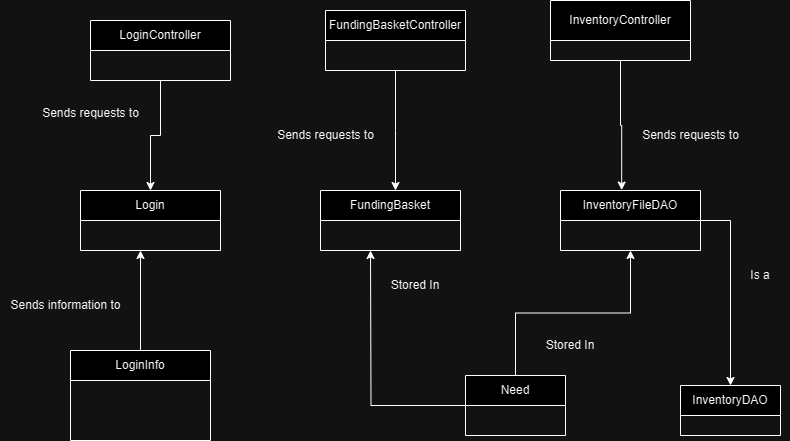
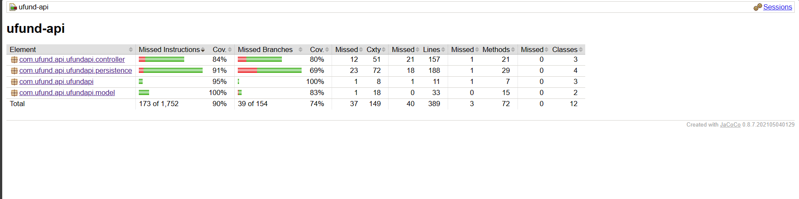

# PROJECT Design Documentation

> _The following template provides the headings for your Design
> Documentation.  As you edit each section make sure you remove these
> commentary 'blockquotes'; the lines that start with a > character
> and appear in the generated PDF in italics._

## Team Information
* Team name: Team Fore
* Team members
  * Jack McCarthy
  * Noah Lago
  * Swapnil Acharjee
  * Michael Passucci

## Executive Summary

* The goal of this project is to create an online U-Fund Manager where a company's Needs are stored and users can fund those needs. the UI will represent a Food Bank using the UFund manager.

### Purpose
> User Goals
* Helper: the goal of a helper is to add needs from the cupboard to their funding basket and then proceed to checkout
* Manager: the goal of the manager is to maintain the cupboard, including removing, adding, and editing needs.

### Glossary and Acronyms
> _**[Sprint 2 & 4]** Provide a table of terms and acronyms._

| Term | Definition |
|------|------------|
| SPA | Single Page |

## Requirements

This section describes the features of the application.

> _In this section you do not need to be exhaustive and list every
> story.  Focus on top-level features from the Vision document and
> maybe Epics and critical Stories._

### Definition of MVP
> MVP
* The MVP of this project is a UI that can allow both Helpers and Managers complete their tasks
* It encapsulates need management, helper functionality, data persistence, abd minimal authentication.

### MVP Features
> Add/Remove items in the Funding Basket
* As a Helper I want to add to my Funding Basket so that I can track how much I want to donate to the organizations.
* As a Helper I want to remove items from my funding basket so that I can update it as needed.
> Create/Search/Update Needs in the funding basket
* AS a Developer I WANT to submit a request to create a new need (name [unique], cost, quantity, type) SO THAT it is added to the cupboard.
* AS a Developer I WANT to submit a request to get the the needs in the cupboard whose name contains the given text, SO THAT I have access to only that subset of needs.
* AS a Developer I WANT to submit a request to get the entire cupboard SO THAT I have access to all of the needs for the organization.
> Create/Add to checkout
* As a Helper I want to check out from the funding basic so that organizations get my money.
* As a Helper I want to add needs to the funding basket so that I can check them out.

### Enhancements
> Enhancement 1: Full Login implementation
* Authenticates existing users
* Enables admin privileges with the correct credentials
> Enhancement 2: User Registration 
* A new user may register with a unique username and a personal password
* They will then benefit from the authentication present in the login implementation
> Enhancement 3: Donation Matching Feature
* When enabled by admin, each donation made by a user will be doubled in the system at no additional cost
* If the stock runs out without matching being complete, matching will end prematurely
> Enhancement 4: Error and Success Messages
* Visual feedback on requests such as login and incorrect actions within the program
* For example, green success bubble when successfully logged in, and a red error bubble when you are denied login

## Application Domain

This section describes the application domain.

> Application Domain
* The Need and LoginInfo classes are used to send information to their respective FileDaos
* Those FileDaos (FundingBasket, Inventory, and Login), then use that information to modify json objects and write to a file
* The three controller classes convert HTTP requests into formats that the FileDaos can understand

## Architecture and Design

This section describes the application architecture.

### Summary

The following Tiers/Layers model shows a high-level view of the webapp's architecture. 
**NOTE**: detailed diagrams are required in later sections of this document. (_When requested, replace this diagram with your **own** rendition and representations of sample classes of your system_.) 

The web application, is built using the Model–View–ViewModel (MVVM) architecture pattern. 

The Model stores the application data objects including any functionality to provide persistance. 

The View is the client-side SPA built with Angular utilizing HTML, CSS and TypeScript. The ViewModel provides RESTful APIs to the client (View) as well as any logic required to manipulate the data objects from the Model.

Both the ViewModel and Model are built using Java and Spring Framework. Details of the components within these tiers are supplied below.

### Overview of User Interface

This section describes the web interface flow; this is how the user views and interacts with the web application.

> User Interface
* In our UI a user must first navigate to the log in page and enter their log in information. After logging in an admin will be able to view and edit the inventory of needs in the inventory page. After logging in a user can view needs and add needs to their checkout from the inventory page and checkout from their basket page.

### View Tier
> _**[Sprint 4]** Provide a summary of the View Tier UI of your architecture.
> Describe the types of components in the tier and describe their
> responsibilities.  This should be a narrative description, i.e. it has
> a flow or "story line" that the reader can follow._

> _**[Sprint 4]** You must  provide at least **2 sequence diagrams** as is relevant to a particular aspects 
> of the design that you are describing.  (**For example**, in a shopping experience application you might create a 
> sequence diagram of a customer searching for an item and adding to their cart.)
> As these can span multiple tiers, be sure to include an relevant HTTP requests from the client-side to the server-side 
> to help illustrate the end-to-end flow._

> _**[Sprint 4]** To adequately show your system, you will need to present the **class diagrams** where relevant in your design. Some additional tips:_
 >* _Class diagrams only apply to the **ViewModel** and **Model** Tier_
>* _A single class diagram of the entire system will not be effective. You may start with one, but will be need to break it down into smaller sections to account for requirements of each of the Tier static models below._
 >* _Correct labeling of relationships with proper notation for the relationship type, multiplicities, and navigation information will be important._
 >* _Include other details such as attributes and method signatures that you think are needed to support the level of detail in your discussion._

### ViewModel Tier
> _**[Sprint 4]** Provide a summary of this tier of your architecture. This
> section will follow the same instructions that are given for the View
> Tier above._

> _At appropriate places as part of this narrative provide **one** or more updated and **properly labeled**
> static models (UML class diagrams) with some details such as critical attributes and methods._
> 

### Model Tier
> _**[Sprint 2, 3 & 4]** Provide a summary of this tier of your architecture. This
> section will follow the same instructions that are given for the View
> Tier above._

> _At appropriate places as part of this narrative provide **one** or more updated and **properly labeled**
> static models (UML class diagrams) with some details such as critical attributes and methods._
> 

## OO Design Principles
> _**[Sprint 2, 3 & 4]** Will eventually address upto **4 key OO Principles** in your final design. Follow guidance in augmenting those completed in previous Sprints as indicated to you by instructor. Be sure to include any diagrams (or clearly refer to ones elsewhere in your Tier sections above) to support your claims._

> _**[Sprint 3 & 4]** OO Design Principles should span across **all tiers.**_

## Principle 1: Controller

Our project features three controllers that are all used to link the our Sping API and out Angular UI. Each controller is capable of processing requests from the Angular UI and calling the correct function in the API tier.

* `FundingBasket`: This was to handle the persistence and checkout pages of all the

## Principle 2: Single Responsibility

Each of our classes is only responsible for a specific task. For example our `LoginContoller` is only responsible for managing Login related requests while our `FundingBasketController` is only responsible for Funding Basket tasks instead of combining these two responsibilities into one giant Controller class.  

The UI 
## Principle 3: Information Expert

* Classes in our system handle the tasks only for which they posses the required information. This is most apparent in our three controller classes. For example the Login controller handles all login requests because it is the only controller that has access to a Login object and therefore is the only controller with the information required to perform login operations

## Static Code Analysis/Future Design Improvements
> _**[Sprint 4]** With the results from the Static Code Analysis exercise, 
> **Identify 3-4** areas within your code that have been flagged by the Static Code 
> Analysis Tool (SonarQube) and provide your analysis and recommendations.  
> Include any relevant screenshot(s) with each area._

> _**[Sprint 4]** Discuss **future** refactoring and other design improvements your team would explore if the team had additional time._

## Testing
> _This section will provide information about the testing performed
> and the results of the testing._

95 tests were run, all tests passed. There was a major focus on fundamental functions to the classes

### Acceptance Testing
> _**[Sprint 2 & 4]** Report on the number of user stories that have passed all their
> acceptance criteria tests, the number that have some acceptance
> criteria tests failing, and the number of user stories that
> have not had any testing yet. Highlight the issues found during
> acceptance testing and if there are any concerns._

All the acceptance tests were fulfilled. However some acceptance tests were discovered to not be fully representative of our vision of what we expected of our components, in which we had to adjust them to better fit our expectations.
### Unit Testing and Code Coverage
> Unit Testing Strategy
* Our unit tests were made to effectively cover everything in the program that could potentially be tested. These tests were run both to check for success and for failures, as knowing where the project fails is pivitol to the success of the project as a whole. Through these tests, we were able to isolate significant issues in our code logic and fix them immediately.

>_**[Sprint 2 & 4]** **Include images of your code coverage report.** If there are any anomalies, discuss
> those._

A major anomaly in the branch coverage was the `FundingBasket` in the persistence section of the API. This was due to the fact that the end of sprint 3 did not send

